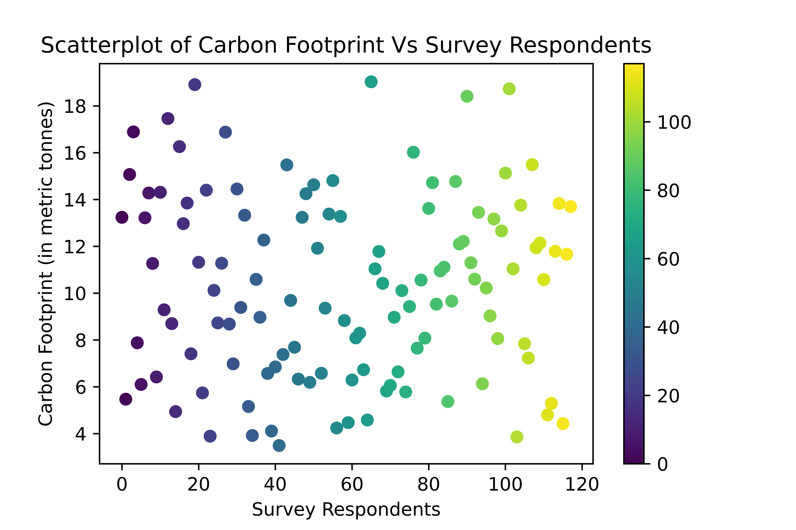
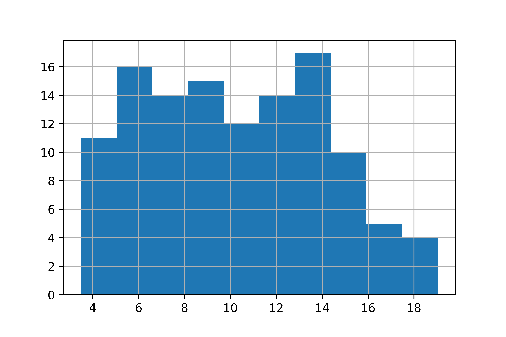

# Carbon Footprint Calculation Project

## Overview

This project aims to calculate the carbon footprint of a university by surveying its population and considering the carbon emissions from its buildings. The survey includes various lifestyle factors that contribute to an individual's carbon footprint. The project then estimates the total carbon footprint of the university population and combines it with the carbon emissions from university buildings to provide an overall assessment.

## Dataset

The project uses a dataset from a carbon footprint survey conducted at the university. The survey collects information on various aspects of individuals' lifestyles, such as energy usage, transportation habits, and dietary choices.

## Methodology

The survey data is processed and transformed, assigning carbon footprint values to different lifestyle choices. The carbon footprint of university buildings is calculated based on electricity consumption. The project then estimates the total carbon footprint of the university by multiplying the average individual carbon footprint by the total university population.

## Results

The project provides insights into the carbon footprint of both the university population and its buildings. The total carbon footprint is presented as a comprehensive metric, considering both individual and collective contributions.

## Visualizations

### Scatterplot of Carbon Footprint vs. Survey Respondents

This scatterplot visualizes the distribution of carbon footprints among survey respondents, highlighting the diversity of individual contributions.

### Histogram of Carbon Footprints

The histogram illustrates the frequency distribution of carbon footprints among the surveyed population.

## Comparative Analysis

To put the university's carbon footprint into perspective:

- **Carbon Footprint of University Buildings:** 168.048 metric tonnes
- **Carbon Footprint of University Population:** 10,453.859 metric tonnes
- **Total Carbon Footprint of the University:** 10,621.907 metric tonnes

These results can be compared with broader environmental benchmarks, such as national or global carbon emissions.

## Conclusion

This project provides valuable insights into the carbon footprint of a university, contributing to sustainability awareness and encouraging initiatives for carbon reduction.